# Notes on Hadooop The Definitive Guide

## Chapter 2 MapReduce
MapReduce is a programming model for data processing.

### Analyzing the Data with Hadoop
**Map and Reduce**
MapReduce works by breaking the processing into two phases: the map phase and the reduce phase. Each phase has key-value pairs as input and output, the types of which may be chosen by the programmer. The programmer also specifies two functions: the map function and the reduce function.

### Scaling Out
**Data Flow**
MapReduce Job is a unit of work that the client wants to be done. It consists of input, MapReduce program and configuration. Hadoop runs the job by dividing into tasks: map tasks and reduce tasks. 
Hadoop divides the input to a MapReduce job into fixed size pieces called splits and create one map task for each split which runs user defined map function in the split.

The sorted map outputs have to be transferred to the node where the reduce task in running. THe outputs are merges and passed to user defined reduce function.

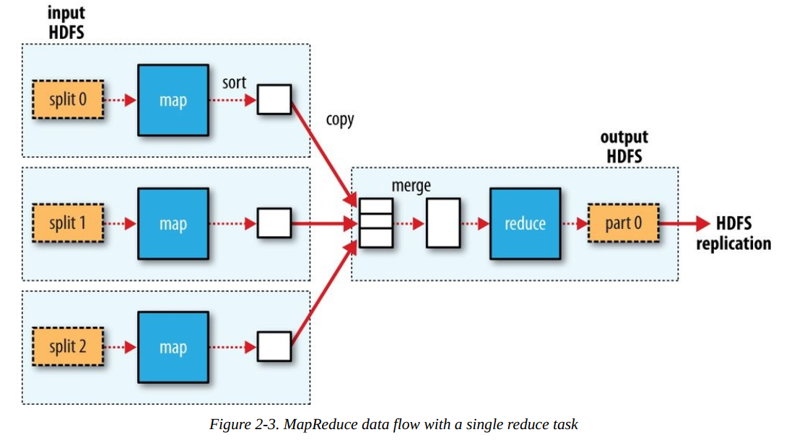

**Combiner Functions**
Combiner function is an optimization function for map output. Hadoop does not guarantee its run.
So calling the combiner function zero, one, or many times should produce the same output from the reducer.


### Hadoop Streaming
Hadoop provides an API to MapReduce that allows you to write your map and reduce functions in languages other than Java. Hadoop Streaming uses Unix standard streams as the interface between Hadoop and your program, so you can use any language that can read standard input and write to standard output to write your MapReduce program.

## Chapter 3 The Hadoop Distributed FileSystem

### HDFS Concepts
HDFS stands for Hadoop Distributed Filesystem.
HDFS is Hadoop’s flagship filesystem and is the focus of this chapter, but Hadoop actually has a general purpose filesystem abstraction which integrates with other storage systems.


HDFS is a filesystem designed for storing very large files with streaming data access
patterns, running on clusters of commodity hardware.
* **Very Large Files**
* **Streaming Data Access:** write once and read many times pattern. reading the whole dataset is more important than latency.
* **Commodity Hardware:** expects node failure and does not require expensive equipments

**HDFS does not wok well with**
* Low Latency Data Access
* Lots of small files
* Multiple writers, arbitrary file modification

HDFS block size 128mb by default , smaller blocks does not occupy full block size
HDFS uses larger block size to reduce seek time.

**Benefits of HDFS blocks**
* Files can be larger than a disk
* It simplifies the storage subsystem
* fits well with replication for fault tolerance and availability as blocks are replicated multiple times

HDFS cluster has two types of nodes working in a master-worker pattern: a `NameNode` (master) and a number of `DataNodes` (worker). NameNode manages filesystem namespace e.g. filesystem tree and metadata for all files. NameNode also knows the datanodes on which all the blocks of a given file are stored.

A client presents a file system similar to POSIX, so user does not know about namenode and datanode.

**NameNode fault tolerance**
1. back up files to multiple filesystems with synchronous and atomics writes to all.
2. Secondary namenode, periodically merge namespace image with edit log to prevent edit log to become large

**Block Caching**
Blocks can be cached to improve read performance. Users can instruct NameNode to which file to cache and for how long by adding a `cache directive to a cache pool`.

**HDFS Federation**
NameNode keeps reference to every file and block in memory which is a bottleneck for scaling. HDFS Federation allows a cluster to scale by adding namenodes each of which splits the filesystem namespace between them. Under federation, each namenode manages namespace volume which are independent of each others. To access federation, clients use client side mount tables to map file paths to namenodes.

**HDFS High Availability**
NameNode is a single point of failure. Hadoop 2 added HDFS High Availability. In this implementation , two namenodes are used in a Active-Standby config. 
**Changes needed for HA**
* namenodes must use highly available shared storage to share edit log. When a standby comes up, it reads up to the end of the shared edit log to synchronize the state with active namenode.
* DataNodes must report to both NameNodes 
* Clients must be configured to handle namenode failover.
* Secondary NameNode's role is subsumed by the standby.

**Choices for HA shared storage**
* NFS filer
* Quorum Journal Manager 
QJM is designed for HA edit log and recommended. QJM runs as a group of journal nodes and each edit must be written to a majority. 

**FailOver and Fencing**
Failover controller manages transition from active to standby. Default implementation uses ZooKeeper to ensure that only one namenode is active.

HA implementation prevents previously active namenode from doing any damage and causing corruption - with Fencing.
**Fencing types**
* in QJM , using SSH fencing command (???)
* in NSF filer, revoke access of the previous namenode or disable network port
* last resort, forced power down - STONITH

Client failover tries each NameNode until it succeeds.

### HDFS CLI
`hadoop fs -copyFromLocal local:source hdfs:dest`
`hadoop fs -copyToLocal hdfs:source local:dest`
`hadoop fs -mkdir dir`
`hadoop fs -ls dest`

### The Java Interface
**Read file with java URL**
```java
    InputStream in = null;
    try {
        in = new URL("hdfs://host/path").openStream();
    // process in
    } finally {
        IOUtils.closeStream(in);
    }
```
Inform JVM about hdfs filesystem
```java
public class URLCat {
    static {
        URL.setURLStreamHandlerFactory(new FsUrlStreamHandlerFactory());
    } 
    public static void main(String[] args) throws Exception {
        InputStream in = null;
        try {
            in = new URL(args[0]).openStream();
            IOUtils.copyBytes(in, System.out, 4096, false);
        } finally {
            IOUtils.closeStream(in);
        }
    }
}
```
How to run
```
$ export HADOOP_CLASSPATH=hadoop-examples.jar
$ hadoop URLCat hdfs://localhost/user/tom/quangle.txt
```
**Read File with HDFS FileSystem API**
```java
public class FileSystemCat {
    public static void main(String[] args) throws Exception {
        String uri = args[0];
        Configuration conf = new Configuration();
        FileSystem fs = FileSystem.get(URI.create(uri), conf);
        InputStream in = null;
        try {
            in = fs.open(new Path(uri));
            IOUtils.copyBytes(in, System.out, 4096, false);
        } finally {
            IOUtils.closeStream(in);
        }
    }
}
```
Run
```
$ hadoop FileSystemCat hdfs://localhost/user/tom/quangle.txt
```
**TODO:**
Write more about Java Interface


### Data Flow
**Anatomy of a File Read**
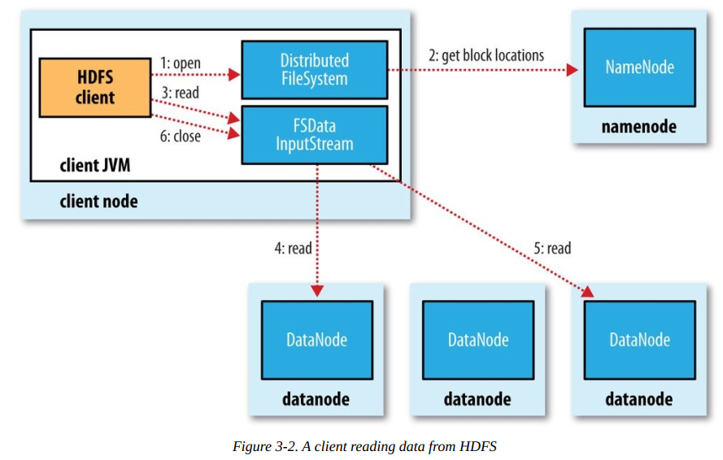
Steps:
* Step 1: A client calls open on DistributedFileSystem object 
* Step 2: DistributedFileSystem calls NameNode using RPC for first few blocks of the file. NameNode returns the datanodes that have copy of the blocks. DistributedFileSystem returns FSDataInputStream. FSDataInputStream in turn wraps a DFSInputStream, which manages the datanode and namenode I/O.
* Step 3: Client calls read() on DFSInputStream, which has stored the datanode addresses for the first few blocks in the file, then connects to the first (closest) datanode for the first block in the file. Data is streamed from the datanode back to the client.
* Step 4: Client calls read() repeatedly on the stream.
* Step 5: After block ends, DFSInputStream close the connection and finds the next block. This happens transparently to the client, which from its point of view is just reading a continuous stream.
* Step 6: When the client has finished reading, it calls close() on the FSDataInputStream.

If DFSInputStream encounters error, then it finds the next datanode for that block.

**Anatomy of a File Write**
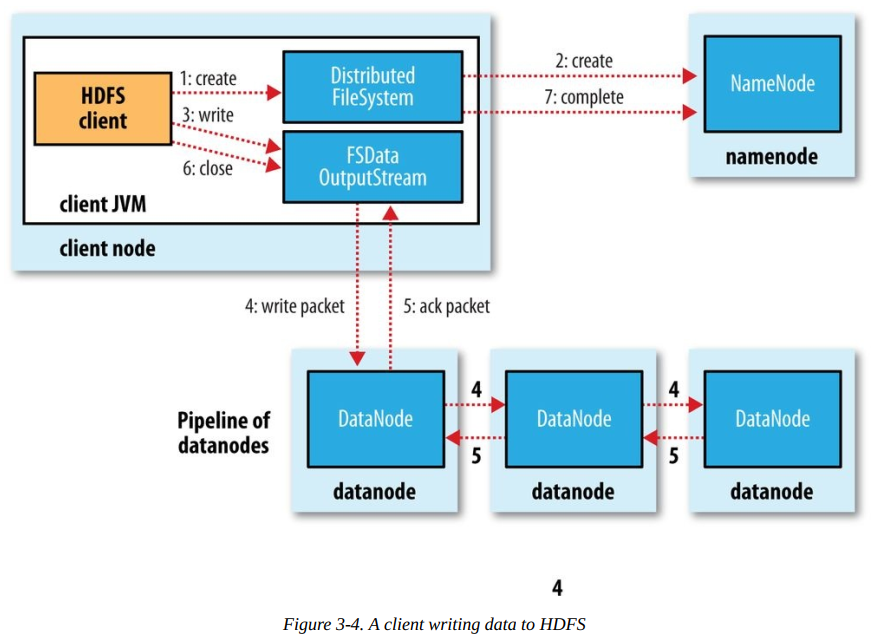
Steps:
* Step 1: Client calls create() on DistributedFileSystem object 
* Step 2: DistributedFileSystem makes an RPC call to NameNode to create a new object with no blocks. DistributedFileSystem returns FSDataOutputStream for client which is wrapped to DFSOutputStream , which handles communication with the datanodes and namenode.
* Step 3: Client calls write() on DFSOutputStream
* Step 4: As clients writes data, the DFSOutputStream splits it into packets, which is consumed by data queue and data queue is consumed by DataStreamer. DataStreamer asks the NameNode to allocate the data. NameNode returns list of DataNodes to store data and for replication. The main data nodes and the replicator datanodes forms a pipeline. DataStreamer streams data to the first datanode , the first one sends data to the next on the pipeline and so on.
* Step 5: DFSOutputStream also maintains an ack queue for packets. When all datanodes of the pipeline acknowledges the packet then it is removed from the ack queue.
* Step 6: When the client has finished writing data, it calls close() on the stream.
* Step 7: All packets from the pipeline are flushed out and after acknowledgement from datanodes contacts the NameNode to signal file in complete.

If failure on step 4, pipeline is closed and packets from ack queue are added to data queue so datanodes that are downstream will not miss any packets. The current block on good datanode will be given a new identity and communicated to namenode. So the partial block will be deleted if the failed node recovers later on. Failed datanode is removed from pipeline and a new pipeline is constructed with good datanodes and data is written to them. NameNode sees that the block is under replicated and arranges another replica to be created on another node.

**Coherency Model**
Coherency Model defines data visibility of reads and writes for a file.  
Data will shown to other reader only when a block is written. A block being written currently will not be shown to other readers.

**Parallel Copying with distcp**
distcp is implemented as a MapReduce job where the work of copying is done by the maps that run in parallel across the cluster. 

## Chapter 4. YARN
YARN (Yet Another Resource Negotiator) is Hadoop's cluster resource management system which is introduced to improve MapReduce implementation.

YARN provides APIs for requesting and working with cluster resources, but these APIs are not typically used directly by user code. Instead, users write to higher-level APIs provided by distributed computing frameworks, which themselves are built on YARN and hide the resource management details from the user.


MapReduce, Spark, and so on running as YARN applications on the cluster compute layer (YARN) 

### Anatomy of a YARN Application Run

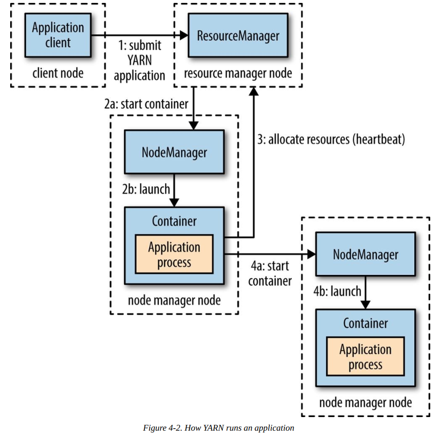

**YARN daemon**
* Resource Manager (one per cluster) : manages use of resources of the cluster
* Node manager (running on all nodes): launch and monitor containers

**Container**: A unix process or Linux cgroup executing an application-specific process with a constrained set of resources

**Application run:**
* Step 1: a client contacts the resource manager and asks it to run an application master process.
* Step 2: Resource Manager finds a node manager that launches the application master in a container.
* Step 3: The Application master might do it's job on a single node and return the result or it might request more containers from the resource manager.
* Step 4: The Application master use the newly allocated container to run a distributed computation. (Just like MapReduce) 

**Resource Requests**
Request parameters: computer resources and locality
Locality can be used to request container on a specific node or rack or anywhere on the cluster.
YARN app can make resource request upfront or dynamically to meet demands.

**Application Lifespan**
Application Models
1. One application per user job
2. One application per workflow or user session of (possibly unrelated) jobs
3. A long-running application that is shared by different users

**YARN Compared to MapReduce 1**
Daemons in MapReduce 1
* A JobTracker: coordinates all jobs run on the system by scheduling tasks. 
* One or more TaskTrackers: runs tasks and send progress to JobTracker, which keeps track of each job

In MapReduce 1, JobTracker takes care of job scheduling and task progress monitoring. In YARN, resource manager and application master takes care of these separately.  
JobTracker also stores job history, but in YARN this is done by TimeLine Server.

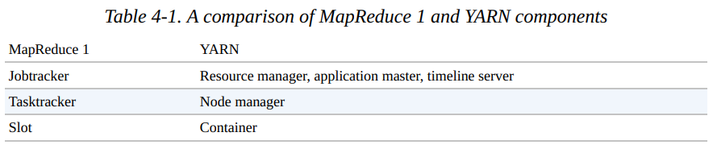

**Limitation of MapReduce 1**
**Scalability**
MapReduce 1 can run with 4000 nodes and 40000 tasks, but YARN can run with 10000 nodes and 100000 tasks.

**Availability**
It is very difficult to retrofit HA into JobTracker. With JobTrackers responsibilities split between Resource Manager and Application Master, it is possible to Make YARN highly available.

**Utilization**
In MapReduce 1, each TaskTracker is configured with static allocation of fixed size slots divided into map slots and reduce slots. In YARN, a node manager manages pool of resources rather designated slots also resourced in YARN are more fine grained, so application can ask for exactly what it needs.

**Multitenancy**
Biggest benefit or YARN it that it opens up Hadoop to other types of distributed application beyond MapReduce.

### Scheduling In YARN
**Yarn Scheduler Options**
* FIFO Scheduler
* Capacity Scheduler
* Fair Scheduler


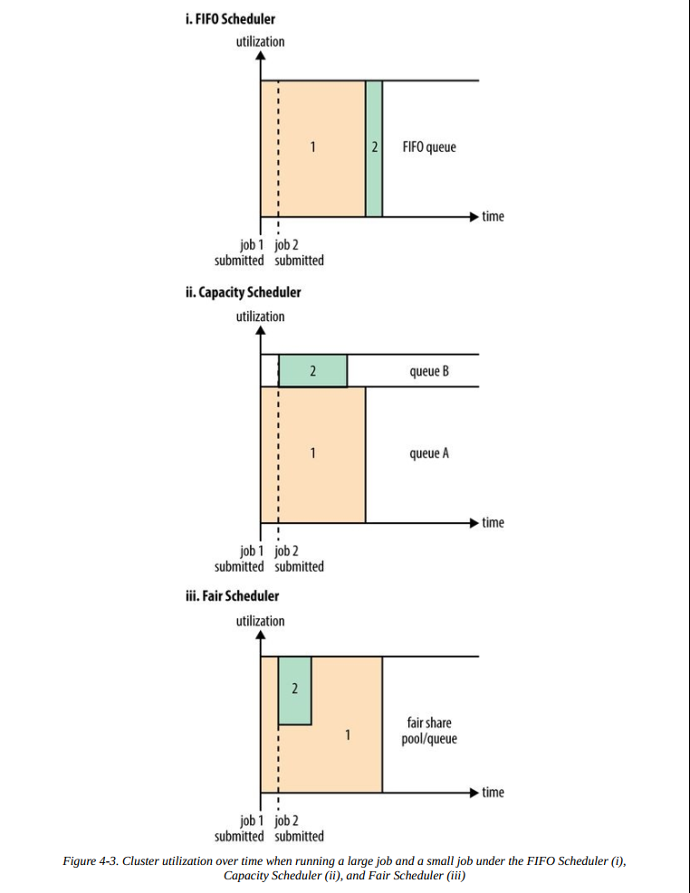
**Capacity Scheduler**
Hadoop cluster is divided into multiple queues allocated to different organization. Each queue can be further divided in hierarchical fashion. In queue applications are scheduled in FIFO order.


**Fair Scheduler**
The Fair Scheduler attempts to allocate resources so that all running applications get the same share of resources. Queues can have weights, which are used in the fair share calculation. Queues can have different scheduling policies. Default is fair scheduling but it also supports FIFO and Dominant Resource Fairness.

**Preemption**
Preemption allows the scheduler to kill containers for queues that are running with more than their fair share of resources so that the resources can be allocated to a queue that is under its fair share. Note that preemption reduces overall cluster efficiency, since the terminated containers need to be re- executed.

**Delay Scheduling**
YARN schedulers try to honor locality requests, but if cluster is busy it may not be possible. However, it has been observed in practice that waiting a short time (no more than a few seconds) can dramatically increase the chances of being allocated a container on the requested node, and therefore increase the efficiency of the cluster. This feature is called delay scheduling, and it is supported by both the Capacity Scheduler and the Fair Scheduler.

**Dominant Resource Fairness**
If multiple resource is needed by application, how to measure fairness. YARN schedulers solve this by using the dominant resource for cluster usage.

Imagine a cluster with a total of 100 CPUs and 10 TB of memory. Application A requests containers of (2 CPUs, 300 GB), and application B requests containers of (6 CPUs, 100 GB). A’s request is (2%, 3%) of the cluster, so memory is dominant since its proportion (3%) is larger than CPU’s (2%). B’s request is (6%, 1%), so CPU is dominant. Since B’s container requests are twice as big in the dominant resource (6% versus 3%), it will be allocated half as many containers under fair sharing.

By default DRF is not used, so during resource calculations, only memory is considered and CPU is ignored. 

## Chapter 5. Hadoop I/O

### Data Integrity
Data integrity is checked in Hadoop via Network Transfer using checksum. CRC-32 is used for checksumming Hadoop's CheckSumFileSystem.

**Data Integrity in HDFS**
HDFS transparently checksums all data written to it and by default verifies checksums when reading data. Datanodes are responsible for verifying the data they receive before storing the data and its checksum. A client writing data sends it to a pipeline of datanodes and the last datanode in the pipeline verifies the checksum. If the datanode detects an error, the client receives a subclass of IOException, which it should handle in an application-specific manner.  
When clients read data from datanodes, they verify checksums as well, comparing them with the ones stored at the datanodes. Each datanode runs a DataBlockScanner in a background thread that periodically verifies all the blocks stored on the datanode. Because HDFS stores replicas of blocks, it can “heal” corrupted blocks by copying one of the good replicas to produce a new, uncorrupt replica.

**LocalFileSystem**
The Hadoop LocalFileSystem performs client-side checksumming. This means that when you write a file called filename, the filesystem client transparently creates a hidden file, .filename.crc, in the same directory.

**ChecksumFileSystem**
LocalFileSystem uses ChecksumFileSystem to do its work, and this class makes it easy to add checksumming to other (nonchecksummed) filesystems, as ChecksumFileSystem is just a wrapper around FileSystem. 

### Compression

**Codecs**
* deflate
* gzip
* bzip2
* lzo
* lz4
* snappy
  
**Compression and Input Splits**
MapReduce will not split zipped file which does not support splitting.

### Serialization

### File-Based Data Structures

**SequenceFile**
SequenceFile provides persistent data structure for binary key-value pairs. SequenceFile works well for logfile and as a container for smaller files.

**The SequenceFile Format**
A sequence file consists of a header followed by one or more records. The first three byts of the file are bytes SEQ, followed by a single byte representing version number. The header also contains key value class names, compression details, user defined metadata and sync marker. sync marker is used to allow a reader to synchronize to a record boundary from any position in the file.

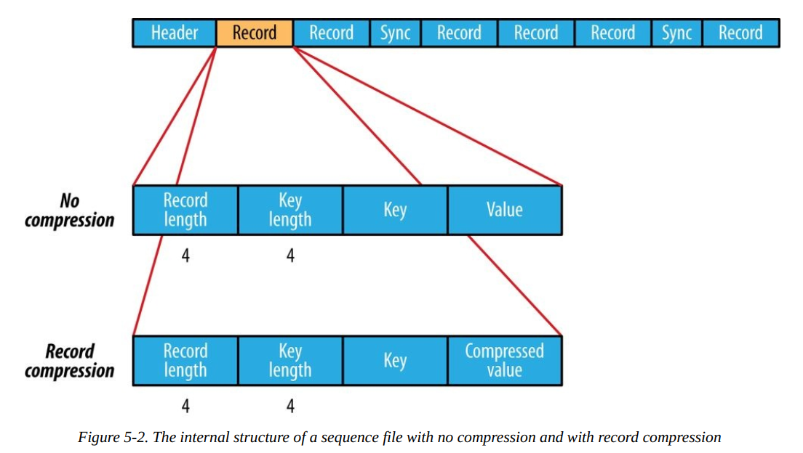

Block compression compresses multiple records at once.A sync marker is written before the start of every block. 

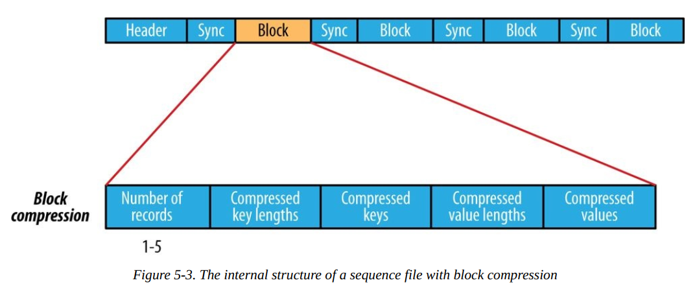

**MapFile**
A MapFile is a sorted SequenceFile with an index to permit lookups by key. The index is itself a SequenceFile that contains a fraction of the keys in the map which can be loaded into memory for faster lookup.

**MapFile Variants**
* SetFile : for storing a set of Writable keys
* ArrayFile: where key is an integer representing the index of the element and the value is a writable value.
* BloomMapFile: with faster version of get() method. Stores the keys in map, if it is in map , then calls regular get() method.

**Other File Formats and Column-Oriented Formats**

**Avro DataFile**
Avro datafiles are like sequence files in that they are designed for large-scale data processing — they are compact and splittable. Objects stored in Avro datafiles are described by a schema.

**Row Oriented File Format**
Values for each row are stored contiguously in the file.
e.g. SequenceFile, MapFile, Avro DataFile

**Column Oriented File Format**
the rows in a file are broken up into row splits, then each split is stored in column-oriented fashion.
e.g. Hive's RCFile superseded by Hive's ORCFile and Parquet

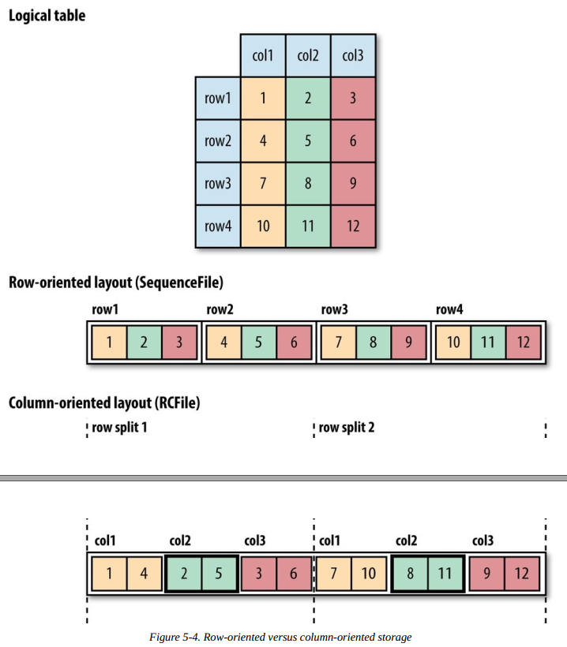


## Chapter 6. Developing a MapReduce Application

## Chapter 7. How MapReduce Works
### Anatomy of a MapReduce Job Run
You can run MapReduce job with method call: `submit()`
There are 5 entities involved in a job
1. The client
2. YARN Node Manager
3. YARN Resource Manager
4. MapReduce Application Master, which coordinates the tasks running the MapReduce job. The application master and the MapReduce tasks run in containers that are scheduled by the resource manager and managed by the node managers
5. HDFS


**Job Submission**
1. Step 1: `submit()` create `JobSubmitter` instance and calls `submitJobInternal()`. After submission `waitForCompletion()` polls job progress per second and shows the output.
2. Step 2: `JobSubmitter` ask resource manager for a new application id used as job id. 
3. Checks the job output specification. Exception if not defined.
4. Compute input splits for job. Exception if something wrong.
5. Step 3: Copies the resources e.g. job jar file, configuration file, computed input splits to the shared filesystem in a directory named after job ID. 
6. Step 4: submit job by `submitApplication()` on resource manager.

**Job Initialization**
1. Step 5: When the resource manager receives a call to its submitApplication() method, it hands off the request to the YARN scheduler. The scheduler allocates a container, and the resource manager then launches the application master’s process there, under the node manager’s management.
2. Step 6: `MRAppMaster` (main class for MapReduce job) initializes job by creating bookkeeping objects for tracking progress of jobs.
3. Step 7: `MRAppMaster` will retrieve input splits from shared filesystem. It will then create a map task for each input split and a number of reduce tasks defined in property.

A small Job: a small job is one that has less than 10 mappers, only one reducer, and an input size that is less than the size of one HDFS block.

If job is small, application master may choose to run the tasks in the same JVM as itself. Such a job is said to be uberized, or run as an uber task.

**Task Assignment**
1. Step 8: If not an uber task, the application master requests container for all map and reduce jobs from resource manager.

Map tasks have data locality which YARN tried to honor.
* Best case : `data-local`
* Second Best case: `rack-local`
* Others

Requests also specify memory requirements and CPUs for tasks. By default, each map and reduce task is allocated 1,024 MB of memory and one virtual core and can be changed with configuration.

**Task Execution**
1. Step 9: after resource manager has assigned resourced for a given task, the application master starts the container by contacting the node manager. The task is executed by a Java Application with main class `YarnChild`. 
2. Step 10: Before run, it localizes the resources the task needs e.g. jar file, config file and any file from cache.
3. Step 11: Finally, it runs the map or reduce task.

**Streaming**
Streaming task communicate with the process using standard input and output streams. During execution , Java process passes input key-value pairs to external process, which runs it through the user-defined map or reduce function and passes the output key-value pairs back to the Java process. From the node manager’s point of view, it is as if the child process ran the map or reduce code itself.

**Progress and Status Updates**
A job and each of its tasks have a status (e.g., running, successfully completed, failed), the progress of maps and reduces, the values of the job’s counters, and a status message or description.

When a task is running, it keeps track of its progress (i.e., the proportion of the task completed). For map tasks, this is the proportion of the input that has been processed. For reduce tasks, it’s the proportion of the reduce input processed. 

Tasks also have a set of counters that count various events (e.g. number of map output records written) as the task runs .

The task reports its progress and status (including counters) back to its application master, which has an aggregate view of the job, every three seconds over the umbilical interface.

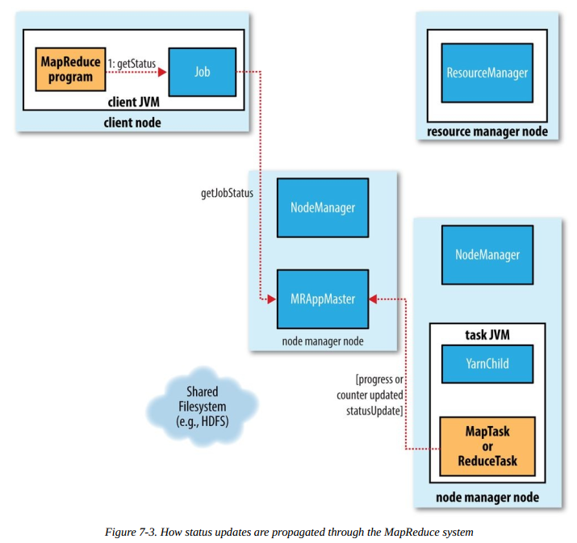

**Job Completion**
When last task for a job is complete, Application Master changes status to `successful`. When job polls for status, it finds `successful` and prints message for user and returns from `waitForCompletion()`.

The application master and task containers clean up their working state and `commitJob()` is called. Job information is archived by job history server.

### Failures
**Task Failure**
* **Runtime Exception** - JVM reports back the error to parent application master before exit. The AppMaster marks the task as failed and frees up the container resources.
* **Sudden Exit of JVM** - Node Manager notices the process is dead and informs AppMaster. AppMaster marks the attempt as failed.
* **Hanging Task** - iF AppMaster does not receive progress update for a while, it will kill the process and mark it as failure. TimeOut period can be configured.

When AppMaster notices a failed task, it will reschedule the task. AppMaster will try to reschedule on a different node it failed. If it fails a certain number of times, it will not be retried again and the job will fail. Default allowed fail count is 4 times. 

You can allow failure of task. In this case you need to configure the maximum percentage of job fail is allowed before job is failed.

A task can be killed if it is speculative duplicate or the node manager dies, then the AppMaster will reschedule the tasks but the failure will not increase the task fail count.

**Application Master Failure**
MapReduce job is retried multiple times if AppMaster failed. Default retry count is 2 but is configurable.

An AppMaster sends heartbeats to Resource manager, when AppMaster fails, the resource manager will detect the failure and start a new AppMaster. The new AppMaster will use the job history to recover the state of the tasks already run by failed AppMaster so they don't have to be rerun. 

Client asks for progress report from AppMaster, when AppMaster fails, client will get a timeout and ask the resource manager for address of new AppMaster.

**Node Manager Failure**
If Node manager fails, it will stop sending heartbeats to resource manager or send them infrequently. Resource manager will remove it from the pool of nodes to schedule containers on. Any task of AppMaster on the node will be recovered. AppMaster will rerun tasks previously completed on the failed Node manager if the job was incomplete.  
Node Manager may be blacklisted if the number of failures for the application is high, even if the node manager has not failed.

**Resource Manager Failure**
For HA, resource manager is run in Active-Standby mode. If Active fails, the standby can take over. Information about all the running applications in stored in a highly available state store backed by ZooKeeper Federation, so standby can recover the core state of the failed resource manager.  
When the new resource manager starts, it reads the application information from the state store, then restarts the application masters for all the applications running on the cluster.  
The transition of a resource manager from standby to active is handled by a failover controller.


### Shuffle and Sort
MapReduce makes the guarantee that the input to every reducer is sorted by key. The process by which the system performs the sort — and transfers the map outputs to the reducers as inputs — is known as the shuffle.

**The Map Side**

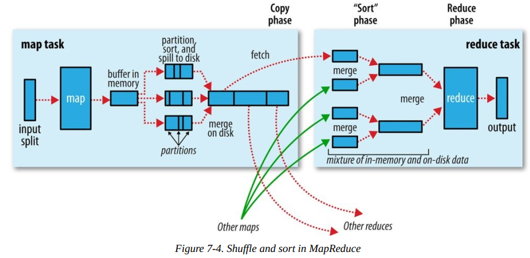

Each map task has a circular memory buffer that it writes the output to. When the contents of the buffer reach a certain threshold size, a background thread will start to spill the contents to disk. Map outputs will continue to be written to the buffer while the spill takes place, but if the buffer fills up during this time, the map will block until the spill is complete. 

Before it writes to disk, the thread first divides the data into partitions corresponding to the reducers that they will ultimately be sent to. Within each partition, the background thread performs an in-memory sort by key, and if there is a combiner function, it is run on the output of the sort. Running the combiner function makes for a more compact map output, so there is less data to write to local disk and to transfer to the reducer.  
The output file’s partitions are made available to the reducers over HTTP.

**The Reduce Side**
* **Copy Phase:** The reduce task starts copying the particular map output for its job, as soon as the map task finishes. As the copies accumulate on disk, a background thread merges them into larger, sorted files.

* **Sort Phase:** after copying done, reduce task merges map output, maintaining sort ordering. This is done in rounds.

* **Reduce Phase:** the reduce function is invoked for each key in the sorted output. The output of this phase is written directly to the output filesystem, typically HDFS.

### Task Execution
**Speculative Execution**
The MapReduce model is to break jobs into tasks and run the tasks in parallel to make the overall job execution time smaller than it would be if the tasks ran sequentially. So one slow task can make the job take significantly longer time.  
Hadoop tries to detect a slow running task and launches another equivalent task as a backup. This is called speculative execution of tasks.
If the original task completes before the speculative task, the speculative task is killed; on the other hand, if the speculative task finishes first, the original is killed.

**Output Committers**
Hadoop MapReduce uses a commit protocol to ensure that jobs and tasks either succeed or fail cleanly. When `setupJob()` is called, `FileOutputCommitter` creates final output directory and a temporary working space,  _temporary as a subdirectory.

If job success, `commitJob()` is called, which creates _SUCCESS directory and deletes _temporary.  
If job fails, `abortJob()` is called with a state object of Job status and it deletes _temporary.

For task `setupTask()` does not do anything, because temporary directories are written as the task outputs are written. Task outputs are written to temporary directory.
If task success, `commitTask()` moves the temporary directory to final directory.
If task fails, `abortTask()` deletes the temporary directory.

**Task side-effect files**
Some application write output files to HDFS, so care needs to be taken to ensure that multiple instances of the same task don’t try to write to the same file. OutputCommitter protocol solves this problem. If applications write side files in their tasks’ working directories, the side files for tasks that successfully complete will be promoted to the output directory automatically, whereas failed tasks will have their side  files deleted.

## Chapter 8. MapReduce Types and Formats
### MapReduce Types
The map and reduce functions in Hadoop MapReduce have the following general form:
```
map: (K1, V1) → list(K2, V2)
reduce: (K2, list(V2)) → list(K3, V3)
```

In general, the map input key and value types (K1 and V1) are different from the map output types (K2 and V2). However, the reduce input must have the same types as the map output, although the reduce output types may be different again (K3 and V3).

If a combiner function is used, then it has the same form as the reduce function (and is an implementation of Reducer), except its output types are the intermediate key and value types (K2 and V2), so they can feed the reduce function:
```
map: (K1, V1) → list(K2, V2)
combiner: (K2, list(V2)) → list(K2, V2)
reduce: (K2, list(V2)) → list(K3, V3)
```
Often the combiner and reduce functions are the same, in which case K3 is the same as K2, and V3 is the same as V2.

### TODO others for this chapter

## Chapter 12. Avro
Apache Avro is a language-neutral data serialization system. Code generation is optional in Avro, which means you can read and write data that conforms to a given schema even if your code has not seen that particular schema before.  To achieve this, Avro assumes that the schema is always present with the data — at both read and write time.  
Avro schemas are usually written in JSON.  
Within certain carefully defined constraints, the schema used to read data need not be identical to the schema that was used to write the
data. This is the mechanism by which Avro supports schema evolution. 
An Avro datafile has a metadata section where the schema is stored, which makes the file self-describing. Avro datafiles support compression and are splittable, which is crucial for a MapReduce data input format. 

Generic Mapping is a type of dynamic avro mapping which can be used even when the schema is not known ahead of runtime.
Specific Mapping is used where you have the schema before you read or write the data.
Reflect Mapping is a java mapping which maps Avro types onto preexisting Java types using reflections.

### Avro Datafile
It is Avro's container file format for storing sequences of Avro objects similar to SequenceFile. Avro datafiles are are designed to be portable across languages. 
A datafile has a header containing metadata, including Avro schema and a sync master, followed by a series of blocks containing the serialized  Avro objects.

## Chapter 13. Parquet
Apache Parquet is ac columnar storage that can efficiently store nested data.  
Columnar formats enable greater efficiency in both file size and query performance. File sizes are usually smaller because values from one column are stored next to each other which allows very efficient encoding. Query performance is improved since a query engine can skip over columns that are not needed. 

Parquet can store data that has a deeply nested structure in true columnar fashion.
Parquet is also supported by a large number of tools.

### Data Model
**Primitive Types**
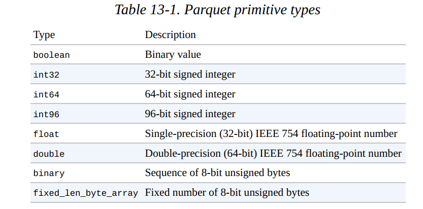

Parquet Data is described by schema, which has root message containing a grep of fields. Each filed has a repetition (`required`, `optional` or `repeated`). For example, 
```
message WeatherRecord {
    required int32 year;
    required int32 temperature;
    required binary stationId (UTF8);
}
```
There is no primitive string type, Parquet defines logical types to interpret primitive types.
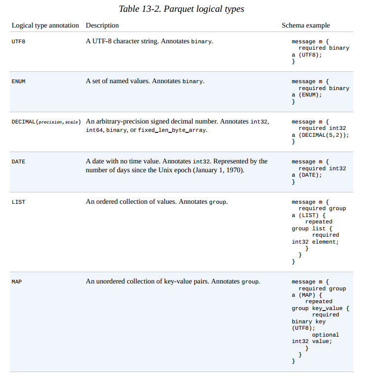

### Parquet File Format
```
File format = Header + one or more blocks + Footer
```
Header contains 4 byte number `PAR1`, which identifies the file as Parquet and the metadata is stored in the footer which includes format version, schema, any extra key-value pairs and metadata for every block. The final two fields in the footer are a 4-byte field encoding the length of the footer metadata, and `PAR1`.

The consequence of storing the metadata in the footer is that reading a Parquet file requires an initial seek to the end of the file (minus 8 bytes) to read the footer metadata length, then a second seek backward by that length to read the footer metadata. Unlike sequence files and Avro datafiles, where the metadata is stored in the header and sync markers are used to separate blocks, Parquet files  don’t need sync markers since the block boundaries are stored in the footer metadata. (This is possible because the metadata is written after all the blocks have been written, so the writer can retain the block boundary positions in memory until the file is closed.)  therefore, Parquet files are splittable, since the blocks can be located after reading the footer and can then be processed in parallel (by MapReduce, for example).

Each block in a Parquet file stores a *row group*, which is made up of column chunks containing the column data for those rows. Each page contains values from the same column, making a page a very good candidate for compression since the values are likely to be similar. 

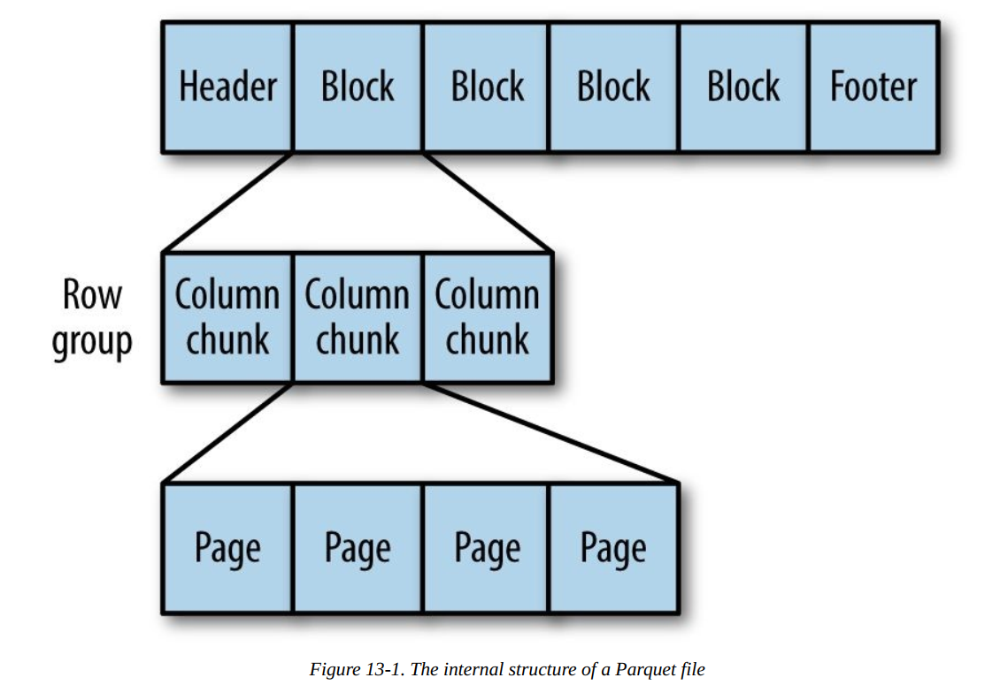

