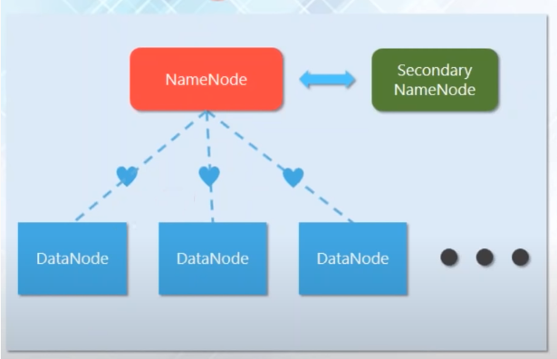
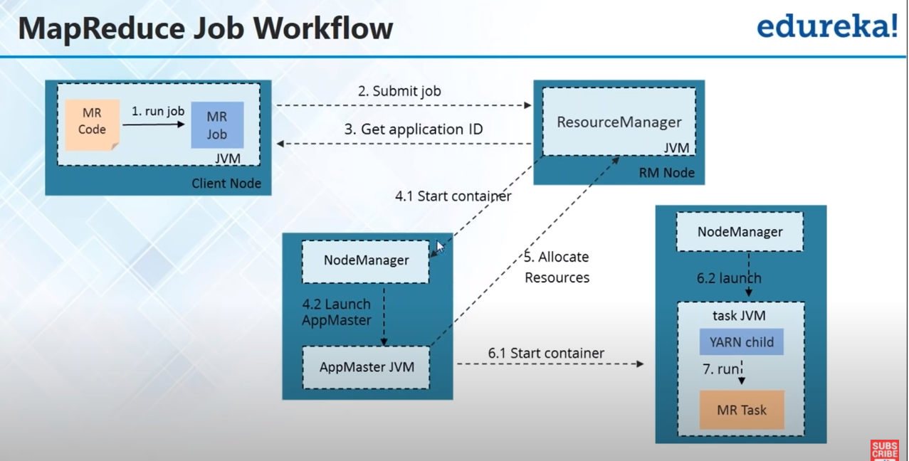
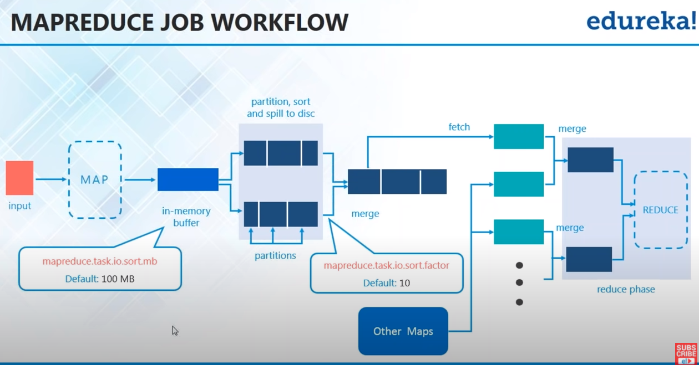
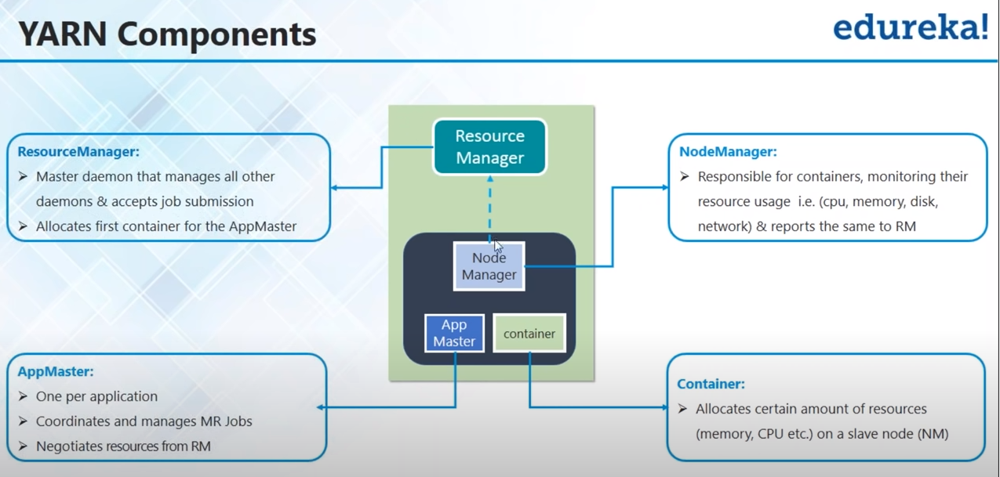
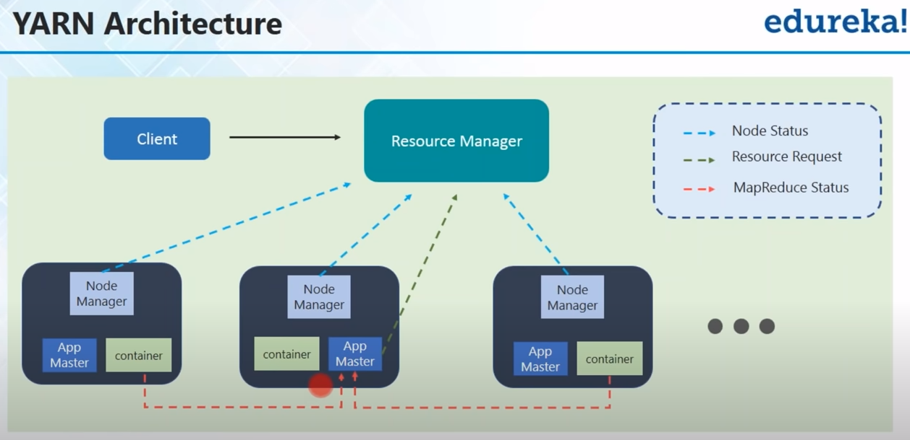
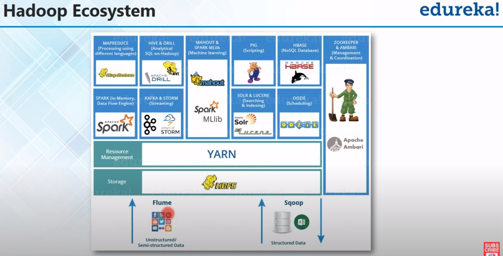
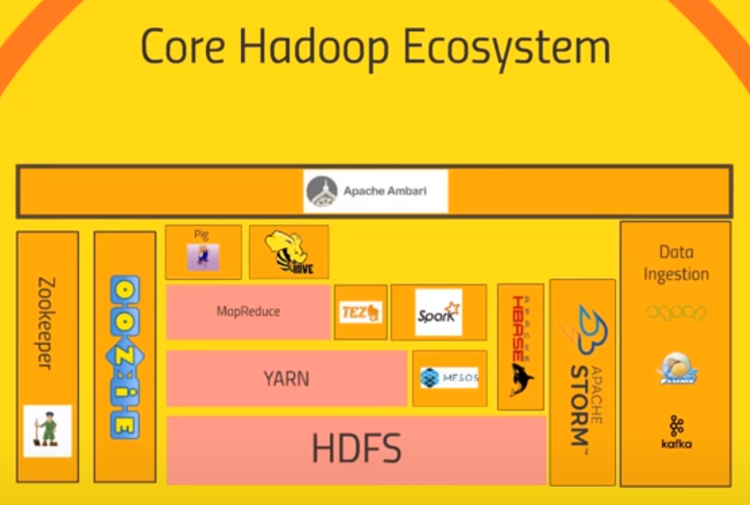

# Big Data
## 5V's of Big Data
* **Volume:** Processing increasing huge data sets
* **Variety:** Processing different type of data
* **Velocity:** Data is generated at an alarming rate
* **Value:** Finding correct meaning out of the data  
* **Veracity:**  Uncertainty and inconsistencies in data

## Hadoop
An open source framework that allows you to store and process large data sets in parallel and distributed fashion
* Hadoop is used for batch processing

### NameNode
* Maintains and manages data nodes
* Records metadata
* receives heartbeat

### DataNode
* Stores actual data
* serves read and write requests from clients

### Secondary NameNode
* Checkpoint management
* Allow faster failover
  

## MapReduce
Algorithm for hadoop
**Map:** Split the work into multiple parts
**Reduce:** Join the result from the multiple jobs
**Parts of MapReduce program**
* **Mapper Code:** How mapping will happen
* **Reducer Code:** How result will be combined
* **Driver Code:** Job Configs

 
## HDFS
Hadoop Distributed File System
* The file system behind hadoop
* Allows to dump any kind of data across the cluster
* Data are being distributed in the hadoop cluster

* HDFS is a block structured file system with size 128 mb
* data is replicated by replication factor 3 by default

## YARN
Yet another resource negotiator 
* (Nothing but MapReduce Version 2) ???
* Allows parallel processing of the data stored in HDFS
### Yarn components
* **Resource Manager:** master daemon, allocates first container to app master
* **AppMaster:** one per app, coordinates and manages jobs, negotiates resources from resource manager
* **NodeManager:** responsible for containers
* **Container:** Allocates resources to slave node

## Hadoop EchoSystem

### Flume
Used for ingesting unstructured or semi structured data

### Sqoop
Used for ingesting structured data

### Hive
Convert MapReduce code to SQL like language

### Drill

### Pig
High Level Scripting language which sits on top of MapReduce

### Zookeeper 
Used for managing hadoop clusters

### Ambari
Cluster Manager for Hadoop

### Mesos
An alternative to yarn

### Oozie 
Scheduler for hadoop jobs

### Storm
* tool for processing real time streaming data

### Solr

### Lucene

### Kafka
* tool for ingesting data from other sources

### HBase
* a very fast no sql database
* Exposes to data of your cluster to transactional platform

### Spark
An open source cluster computing framework for real time processing.
* Spark is used for real time processing 
* Spark is faster than MapReduce
* Spark can run on YARN with Hadoop Cluster
* Spark can user HDFS as storage
* Can handle SQL query 
* Can apply ML on cluster

### Tez
* Similar to spark, produces more optimized query than MapReduce
* Can be use used with Hive
