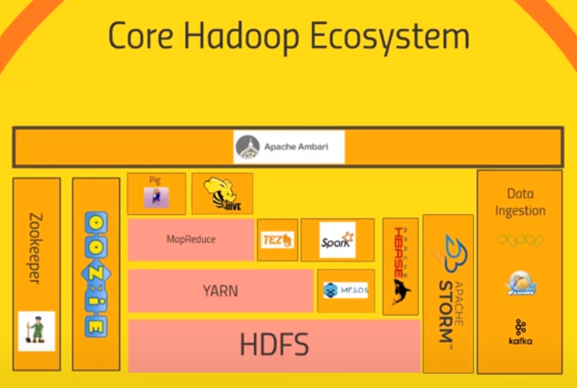
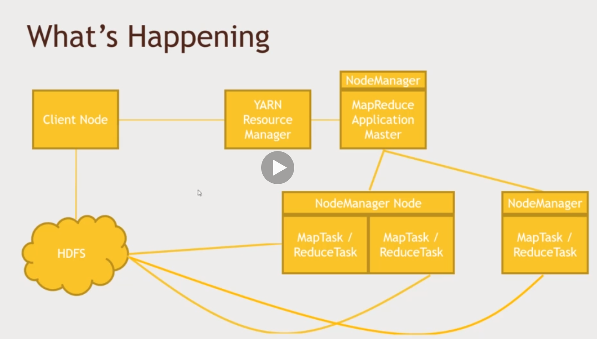

## Lecture 6 Hadoop Overview and History
### What is Hadoop
An open source software platform for distributed storage and distributed processing of very large data sets on computers clusters build from commodity hardware.

#### Why Hadoop
* Data is too damn big
* Vertical scaling does not work
* Horizontal scaling is linear
* Hadoop: it's not just for batch process anymore

## Lecture 7 Overview of the Hadoop Ecosystem
### Hadoop EchoSystem

#### HDFS
Hadoop Distributed File System

#### YARN
Yet another resource negotiator 

#### MapReduce
Algorithm for hadoop
**Map:** Split the work into multiple parts
**Reduce:** Join the result from the multiple jobs

#### Flume
Used for ingesting unstructured or semi structured data

#### Sqoop
Used for ingesting structured data

#### Hive
Convert MapReduce code to SQL like language

#### Pig
High Level Scripting language which sits on top of MapReduce

#### Zookeeper 
Used for managing hadoop clusters

#### Ambari
Cluster Manager for Hadoop

#### Mesos
An alternative to yarn

#### Oozie 
Scheduler for hadoop jobs

#### Storm
* tool for processing real time streaming data

#### Kafka
* tool for ingesting data from other sources

#### HBase
* a very fast no sql database
* Exposes to data of your cluster to transactional platform

#### Spark
An open source cluster computing framework for real time processing.

#### Tez
* Similar to spark, produces more optimized query than MapReduce
* Can be use used with Hive

## Lecture 8 HDFS: What it is and how it works
Files are split into 128mb blocks. Blocks are replicated to multiple times.

**HDFS Architecture**
Single NameNode and one or more DataNodes. 

**Reading A File**
Client asks namenode for file, namenode will return the address of blocks. Client will go to that datanodes to retrive the blocks.

**Writing A File**
Client asks NameNode to store a file. NameNode returns a list of DataNodes to store the file. Client sends the data to first datanode, the first one stores the data and send it to the second one and so on. When the last one saved the data , it return ack to the previous one, and so on, finally client receives ack and informs Namenode that writing done.

**NameNode Failure Handling**
* Backup Metadata, namenode writes to local disk and nfs, in case of failure it read the data when boot.
* Secondary NameNode, maintains merged copy of edit log for backup
* HDFS Federation, each namenode manages a specific namespace volume
* HDFS H/A, Hot standby namenode using shared edit log, ZooKeeper tracks active namenode, uses extreme measure to ensure only one namenode is uses at a time.

**HDFS Usage:**
UI (Ambari), CLI, HTTP/HDFS Proxies, Java Interface, NFS Gateway

## Lecture 11. MapReduce: What it is and how it works
**Why MapReduce**
* Distributes the processing of data on your cluster
* Divides the data up into partitions that are MAPPED and REDUCED by mapper and reducer functions
* Resilient to failure - an application master monitors your mappers and reducers on each partition

**How MapReduce Works: Mapping**
* The mapper converts raw source data into key/value pairs
* The mapper automatically aggregates together all values for each unique key (Shuffle) and then sorts the keys(Sort).
* The reducer processes each keys values

## Lecture 12. How mapReduce distributes processing
Mapper splits the input into multiple slots and then separate datanodes process them separately.
Shuffle and sort aggregates and sort the mapper output.
Multiple reducers reduce different keys.

**How are mappers and reducers written?**
* native java
* streaming with other languages like python

**Handling Failure**
* Application master monitors worker tasks for error, restart as needed , preferably on a different node
* If application master goes down, YARN can try to restart it.
* If entire node goes down, resource manager will try to restart it.
* if resource manager goes down, HA using ZooKeeper have a standby.

