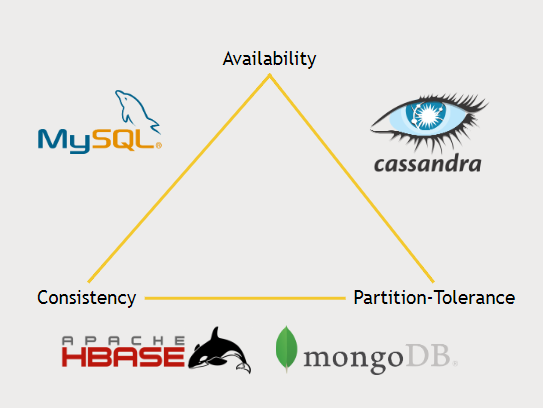

## Lecture 6 Hadoop Overview and History
### What is Hadoop
An open source software platform for distributed storage and distributed processing of very large data sets on computers clusters build from commodity hardware.

#### Why Hadoop
* Data is too damn big
* Vertical scaling does not work
* Horizontal scaling is linear
* Hadoop: it's not just for batch process anymore

## Lecture 7 Overview of the Hadoop Ecosystem
### Hadoop EchoSystem


#### HDFS
Hadoop Distributed File System

#### YARN
Yet another resource negotiator 

#### MapReduce
Algorithm for hadoop
**Map:** Split the work into multiple parts
**Reduce:** Join the result from the multiple jobs

#### Flume
Used for ingesting unstructured or semi structured data

#### Sqoop
Used for ingesting structured data

#### Hive
Convert MapReduce code to SQL like language

#### Pig
High Level Scripting language which sits on top of MapReduce

#### Zookeeper 
Used for managing hadoop clusters

#### Ambari
Cluster Manager for Hadoop

#### Mesos
An alternative to yarn

#### Oozie 
Scheduler for hadoop jobs

#### Storm
* tool for processing real time streaming data

#### Kafka
* tool for ingesting data from other sources

#### HBase
* a very fast no sql database
* Exposes to data of your cluster to transactional platform

#### Spark
An open source cluster computing framework for real time processing.


#### Tez
* Similar to spark, produces more optimized query than MapReduce
* Can be use used with Hive

## Lecture 8 HDFS: What it is and how it works
Files are split into 128mb blocks. Blocks are replicated to multiple times.

**HDFS Architecture**
Single NameNode and one or more DataNodes. 

**Reading A File**
Client asks namenode for file, namenode will return the address of blocks. Client will go to that datanodes to retrive the blocks.

**Writing A File**
Client asks NameNode to store a file. NameNode returns a list of DataNodes to store the file. Client sends the data to first datanode, the first one stores the data and send it to the second one and so on. When the last one saved the data , it return ack to the previous one, and so on, finally client receives ack and informs Namenode that writing done.


**NameNode Failure Handling**
* Backup Metadata, namenode writes to local disk and nfs, in case of failure it read the data when boot.
* Secondary NameNode, maintains merged copy of edit log for backup
* HDFS Federation, each namenode manages a specific namespace volume
* HDFS H/A, Hot standby namenode using shared edit log, ZooKeeper tracks active namenode, uses extreme measure to ensure only one namenode is uses at a time.

**HDFS Usage:**
UI (Ambari), CLI, HTTP/HDFS Proxies, Java Interface, NFS Gateway

## Lecture 11. MapReduce: What it is and how it works
**Why MapReduce**
* Distributes the processing of data on your cluster
* Divides the data up into partitions that are MAPPED and REDUCED by mapper and reducer functions
* Resilient to failure - an application master monitors your mappers and reducers on each partition

**How MapReduce Works: Mapping**
* The mapper converts raw source data into key/value pairs
* The mapper automatically aggregates together all values for each unique key (Shuffle) and then sorts the keys(Sort).
* The reducer processes each keys values


## Lecture 12. How mapReduce distributes processing
Mapper splits the input into multiple slots and then separate datanodes process them separately.
Shuffle and sort aggregates and sort the mapper output.
Multiple reducers reduce different keys.


**How are mappers and reducers written?**
* native java
* streaming with other languages like python

**Handling Failure**
* Application master monitors worker tasks for error, restart as needed , preferably on a different node
* If application master goes down, YARN can try to restart it.
* If entire node goes down, resource manager will try to restart it.
* if resource manager goes down, HA using ZooKeeper have a standby.

## Chapter 19. Introduction to Ambari
Ambari is a UI for Hadoop Component
Reset ambari admin pw
```
# su root
# ambari-admin-password-reset
```
Ambari will restart. Login to Ambari with admin/new_pw

## Chapter 20. Introducing Pig
Pig uses Pig latin, a scripting language like sql to define map and reduce steps.
Pig stand on top of  MapReduce and Tez which is faster than MapReduce and uses them, so there is no performance penalty for using Pig. 
Tez uses directed acyclic graph looks into the inter relation of the steps and finds the most optimal path for executing steps , so it is faster than MapReduce.

## Chapter 22. Find old 5-start movies with Pig
```python
ratings = LOAD '/user/maria_dev/ml-100k/u.data' AS (userID:int, movieID:int, rating:int, ratingTime:int);
metadata = LOAD '/user/maria_dev/ml-100k/u.item' USING PigStorage('|')
	AS (movieID:int, movieTitle:chararray, releaseDate:chararray, videoRealese:chararray, imdblink:chararray);
   
nameLookup = FOREACH metadata GENERATE movieID, movieTitle,
	ToUnixTime(ToDate(releaseDate, 'dd-MMM-yyyy')) AS releaseTime;
   
ratingsByMovie = GROUP ratings BY movieID;
avgRatings = FOREACH ratingsByMovie GENERATE group as movieID, AVG(ratings.rating) as avgRating;
fiveStarMovies = FILTER avgRatings BY avgRating > 4.0;
fiveStarsWithData = JOIN fiveStarMovies BY movieID, nameLookup BY movieID;
oldestFiveStarMovies = ORDER fiveStarsWithData BY nameLookup::releaseTime;
DUMP oldestFiveStarMovies;
```

## Chapter 23. More Pig Latin
PIG QUERY commands
* LOAD STORE DUMP
* FILTER DISTINCT FOREACH/GENERATE MAPREDUCE STREAM SAMPLE
* JOIN COGROUP GROUP CROSS CUBE
* ORDER RANK LIMIT
* UNION SPLIT

Pig Diagnostic Commands
* DESCRIBE
* EXPLAIN
* ILLUSTRATE

PIG UDF Commands
* REGISTER
* DEFINE
* IMPORT

Others
* AVG CONCAT COUNT MAX MIN SIZE SUM
* PigStorage
* TextLoader
* JsonLoader
* AvroStorage
* ParquetLoader
* OrcStorage
* HBaseStorage

## Chapter 26. Why Spark?
 


**Driver Program** is a script which controls what's going to happen in your job
**Cluster manager** spark can use YARN or any other cluster manager like mesos or the built in cluster manager. Spark can run on Hadoop but it can work with other frameworks.

**Executor** - spark tries to retain as much information it can in memory

Spark is 100x faster than MapReduce in memory or 10x faster in disk.
Spark uses Directed Acyclic Graph to optimize workflows.
Spark is build around one main concept : the Resilient Distributed Dataset (RDD)


**Spark Streaming** - allows real time data ingestion and processing for Spark
**Spark SQL** - SQL interface for Spark
**MLLib** - machine learning and data mining library for Spark
**GraphX** - graph interface for Spark

## Chapter 27. THe Resilient Distributed Dataset (RDD)
It is a abstraction that hides the real data from programmer and presents the user with a Dataset interface.

**The SparkContext**
* created by driver program
* it creates and is responsible for RDD's
* spark shell creates a `sc` object for user

RDD's can be created from local file system, hdfs, s3, hive, JDBC, Cassandra, HBase, Elasticsearch, etc.

**Transforming RDD's**
* map
* flatmap
* filter
* distinct
* filter
* sample
* union, intersection, subtract, cartesian

**RDD Actions**
* collect
* count
* countByValue
* take
* top
* reduce
* and others

## Chapter 28. Find the movie with the lowest average rating -with RDD's
```python
from pyspark import SparkConf, SparkContext

# This function just creates a Python "dictionary" we can later
# use to convert movie ID's to movie names while printing out
# the final results.
def loadMovieNames():
    movieNames = {}
    with open("ml-100k/u.item") as f:
        for line in f:
            fields = line.split('|')
            movieNames[int(fields[0])] = fields[1]
    return movieNames

# Take each line of u.data and convert it to (movieID, (rating, 1.0))
# This way we can then add up all the ratings for each movie, and
# the total number of ratings for each movie (which lets us compute the average)
def parseInput(line):
    fields = line.split()
    return (int(fields[1]), (float(fields[2]), 1.0))

if __name__ == "__main__":
    # The main script - create our SparkContext
    conf = SparkConf().setAppName("WorstMovies")
    sc = SparkContext(conf = conf)

    # Load up our movie ID -> movie name lookup table
    movieNames = loadMovieNames()

    # Load up the raw u.data file
    lines = sc.textFile("hdfs:///user/maria_dev/ml-100k/u.data")

    # Convert to (movieID, (rating, 1.0))
    movieRatings = lines.map(parseInput)

    # Reduce to (movieID, (sumOfRatings, totalRatings))
    ratingTotalsAndCount = movieRatings.reduceByKey(lambda movie1, movie2: ( movie1[0] + movie2[0], movie1[1] + movie2[1] ) )

    # Map to (movieID, averageRating)
    averageRatings = ratingTotalsAndCount.mapValues(lambda totalAndCount : totalAndCount[0] / totalAndCount[1])

    # Sort by average rating
    sortedMovies = averageRatings.sortBy(lambda x: x[1])

    # Take the top 10 results
    results = sortedMovies.take(10)

    # Print them out:
    for result in results:
        print(movieNames[result[0]], result[1])
```

## Chapter 29. Datasets and Spark 2.0
DataFrame extends RDD to a DataFrame object.
DataFrame contain Row objects and can run SQL queries

Use SparkSQL in Python
```python
from pyspark.sql import SQLContext, Row
hiveContext = HiveContext(sc)
inputData = spark.read.json(datafile)
inputData.createOrReplaceTempView(structuredView)
dataFrame = hiveContext.sql("sql query")
```

In Spark 2.0, a DataFrame in really a DataSet of Row objects.
Use can use user defined functions.

## Chapter 30. Find the movie with the lowest average rating -with DataFrames
```python
from pyspark.sql import SparkSession
from pyspark.sql import Row
from pyspark.sql import functions

def loadMovieNames():
    movieNames = {}
    with open("ml-100k/u.item") as f:
        for line in f:
            fields = line.split('|')
            movieNames[int(fields[0])] = fields[1]
    return movieNames

def parseInput(line):
    fields = line.split()
    return Row(movieID = int(fields[1]), rating = float(fields[2]))

if __name__ == "__main__":
    # Create a SparkSession
    spark = SparkSession.builder.appName("PopularMovies").getOrCreate()

    # Load up our movie ID -> name dictionary
    movieNames = loadMovieNames()

    # Get the raw data
    lines = spark.sparkContext.textFile("hdfs:///user/maria_dev/ml-100k/u.data")
    # Convert it to a RDD of Row objects with (movieID, rating)
    movies = lines.map(parseInput)
    # Convert that to a DataFrame
    movieDataset = spark.createDataFrame(movies)

    # Compute average rating for each movieID
    averageRatings = movieDataset.groupBy("movieID").avg("rating")

    # Compute count of ratings for each movieID
    counts = movieDataset.groupBy("movieID").count()

    # Join the two together (We now have movieID, avg(rating), and count columns)
    averagesAndCounts = counts.join(averageRatings, "movieID")

    # Pull the top 10 results
    topTen = averagesAndCounts.orderBy("avg(rating)").take(10)

    # Print them out, converting movie ID's to names as we go.
    for movie in topTen:
        print (movieNames[movie[0]], movie[1], movie[2])

    # Stop the session
    spark.stop()
```


## Chapter 31. Movie recommendations with MLLib
```python
from pyspark.sql import SparkSession
from pyspark.ml.recommendation import ALS
from pyspark.sql import Row
from pyspark.sql.functions import lit

# Load up movie ID -> movie name dictionary
def loadMovieNames():
    movieNames = {}
    with open("ml-100k/u.item") as f:
        for line in f:
            fields = line.split('|')
            movieNames[int(fields[0])] = fields[1].decode('ascii', 'ignore')
    return movieNames

# Convert u.data lines into (userID, movieID, rating) rows
def parseInput(line):
    fields = line.value.split()
    return Row(userID = int(fields[0]), movieID = int(fields[1]), rating = float(fields[2]))


if __name__ == "__main__":
    # Create a SparkSession
    spark = SparkSession.builder.appName("MovieRecs").getOrCreate()

    # Load up our movie ID -> name dictionary
    movieNames = loadMovieNames()

    # Get the raw data
    lines = spark.read.text("hdfs:///user/maria_dev/ml-100k/u.data").rdd

    # Convert it to a RDD of Row objects with (userID, movieID, rating)
    ratingsRDD = lines.map(parseInput)

    # Convert to a DataFrame and cache it
    ratings = spark.createDataFrame(ratingsRDD).cache()

    # Create an ALS collaborative filtering model from the complete data set
    als = ALS(maxIter=5, regParam=0.01, userCol="userID", itemCol="movieID", ratingCol="rating")
    model = als.fit(ratings)

    # Print out ratings from user 0:
    print("\nRatings for user ID 0:")
    userRatings = ratings.filter("userID = 0")
    for rating in userRatings.collect():
        print movieNames[rating['movieID']], rating['rating']

    print("\nTop 20 recommendations:")
    # Find movies rated more than 100 times
    ratingCounts = ratings.groupBy("movieID").count().filter("count > 100")
    # Construct a "test" dataframe for user 0 with every movie rated more than 100 times
    popularMovies = ratingCounts.select("movieID").withColumn('userID', lit(0))

    # Run our model on that list of popular movies for user ID 0
    recommendations = model.transform(popularMovies)

    # Get the top 20 movies with the highest predicted rating for this user
    topRecommendations = recommendations.sort(recommendations.prediction.desc()).take(20)

    for recommendation in topRecommendations:
        print (movieNames[recommendation['movieID']], recommendation['prediction'])

    spark.stop()

```
## Chapter 34. What is Hive?
Translates SQL queries to MapReduce or Tez jobs on your cluster.
Advantages
* scalable
* easier
* optimized
* extensible
Disadvantages
* high latency
* no transactions
* no record level update, delete, insert

## Chapter 36. How Hive works ?
Hive maintains a `metastore` that applies a structure on the unstructured data when you are reading.
Other RDBMS applies schema while write but Hive stores the data as unstructured but applies schema while reading.

Create table command
```sql
CREATE TABLE ratings (
    userID INT,
    movieID INT,
    rating INT,
    time INT)
ROW FORMAT DELIMTED FIELDS TERMINATED BY '\t' STORED AS TEXTFILE;
LOAD DATA LOCAL INPATH '${env:HOME}/ml-100k/u.data' OVERWRITE INTO TABLE ratings;
```

HIVE *moves* data from distributed filesystem into Hive while `LOAD DATA`
HIVE *copies* data from distributed filesystem into Hive while `LOAD DATA LOCAL`

Managed Table : Hive takes ownership of the data. Drop command will delete the data.
External Table: Hive will not have ownership of the data. Drop command will delete the metadata but not the actual data.
```sql
CREATE EXTERNAL TABLE IF NOT EXISTS ratings (
    userID INT,
    movieID INT,
    rating INT,
    time INT)
ROW FORMAT DELIMITED FIELDS TERMINATED BY '\t’' LOCATION '/data/ml-100k/u.data';
```
You can store your data in partitioned subdirectories – Huge optimization if your queries are only on certain partitions.

```sql
CREATE TABLE customers (
    name STRING,
    address STRUCT<street:STRING, city:STRING, state:STRING, zip:INT>)
PARTITIONED BY (country STRING);
```
File Structure
```
.../customers/country=CA/
.../customers/country=GB/
```

## Chapter 39. Integrating MySQL with Hadoop
Scoop exports data from RDBMS to HDFS.
Scoops runs multiple mapReduce jobs to export data from RDBMS to HDFS.


## Chapter 43. Why NoSQL ?
For analytic queries , Hive, Pig, Spark etc. work great.
But for work at giant scale, non relational database is fast and scalable.

## Chapter 44. What is HBase
HBase is a non relational scalable database built on HDFS.
HBase splits up different Region Servers (Region means ranges of keys).
HBase supports auto sharding.
HMaster keeps the schema of the data.
ZooKeeper keeps track of HMaster master nodes.


### HBase Data Models
* Fast access to any given ROW
* A ROW is referenced by a unique KEY
* Each ROW has some small number of COLUMN FAMILIES
* A COLUMN FAMILY may contain arbitrary COLUMNS
* You can have a very large number of COLUMNS in a COLUMN FAMILY
* Each CELL can have many VERSIONS with given timestamps
* Sparse data is A-OK –missing columns in a row consume no storage.


## Chapter 45. Import movie rating into HBase
Python client with hbase rest client
```python
from starbase import Connection

c = Connection("127.0.0.1", "8000")

ratings = c.table('ratings')

if (ratings.exists()):
    print("Dropping existing ratings table\n")
    ratings.drop()

ratings.create('rating')

print("Parsing the ml-100k ratings data...\n")
ratingFile = open("e:/Downloads/ml-100k/ml-100k/u.data", "r")

batch = ratings.batch()

for line in ratingFile:
    (userID, movieID, rating, timestamp) = line.split()
    batch.update(userID, {'rating': {movieID: rating}})

ratingFile.close()

print ("Committing ratings data to HBase via REST service\n")
batch.commit(finalize=True)

print ("Get back ratings for some users...\n")
print ("Ratings for user ID 1:\n")
print (ratings.fetch("1"))
print ("Ratings for user ID 33:\n")
print (ratings.fetch("33"))

ratings.drop()
```

## Chapter 46. Use HBase with Pig to import data at scale
PIG script
```python
users = LOAD '/user/maria_dev/ml-100k/u.user' 
USING PigStorage('|') 
AS (userID:int, age:int, gender:chararray, occupation:chararray, zip:int);

STORE users INTO 'hbase://users' 
USING org.apache.pig.backend.hadoop.hbase.HBaseStorage (
'userinfo:age,userinfo:gender,userinfo:occupation,userinfo:zip');
```

## Chapter 47. Cassandra Overview
Cassandra is a distributed database system with no single point fo failure. It has no master node , so it's has been engineered for availability. It has CQL query language for interface. 
CAP theorem - ` You can have only 2 of 3: consistency, availability and partition tolerance`. Partition tolerance is a must for big data. 
Cassandra favors availability over consistency. It is eventually consistent. You will not get your data right away and it might take a few seconds to propagate. But cassandra can be tuned for consistency. You can specify the requirements for consistency as how many nodes to agree on a result before acceptance.

## Chapter 50. Write Spark Output into Cassandra
Use SPARK 2
```python
from pyspark.sql import SparkSession
from pyspark.sql import Row
from pyspark.sql import functions

def parseInput(line):
    fields = line.split('|')
    return Row(user_id = int(fields[0]), age = int(fields[1]), gender = fields[2], occupation = fields[3], zip = fields[4])

if __name__ == "__main__":
    # Create a SparkSession
    spark = SparkSession.builder.appName("CassandraIntegration").config("spark.cassandra.connection.host", "127.0.0.1").getOrCreate()

    # Get the raw data
    lines = spark.sparkContext.textFile("hdfs:///user/maria_dev/ml-100k/u.user")
    # Convert it to a RDD of Row objects with (userID, age, gender, occupation, zip)
    users = lines.map(parseInput)
    # Convert that to a DataFrame
    usersDataset = spark.createDataFrame(users)

    # Write it into Cassandra
    usersDataset.write\
        .format("org.apache.spark.sql.cassandra")\
        .mode('append')\
        .options(table="users", keyspace="movielens")\
        .save()

    # Read it back from Cassandra into a new Dataframe
    readUsers = spark.read\
    .format("org.apache.spark.sql.cassandra")\
    .options(table="users", keyspace="movielens")\
    .load()

    readUsers.createOrReplaceTempView("users")

    sqlDF = spark.sql("SELECT * FROM users WHERE age < 20")
    sqlDF.show()

    # Stop the session
    spark.stop()
```

## Chapter 51. MongoDB Overview
Document based NoSQL database. Prefers Consistency and Partition Tolerance over Availability.

## Chapter 52. Integrate Spark with MongoDB
```python
from pyspark.sql import SparkSession
from pyspark.sql import Row
from pyspark.sql import functions

def parseInput(line):
    fields = line.split('|')
    return Row(user_id = int(fields[0]), age = int(fields[1]), gender = fields[2], occupation = fields[3], zip = fields[4])

if __name__ == "__main__":
    # Create a SparkSession
    spark = SparkSession.builder.appName("MongoDBIntegration").getOrCreate()

    # Get the raw data
    lines = spark.sparkContext.textFile("hdfs:///user/maria_dev/ml-100k/u.user")
    # Convert it to a RDD of Row objects with (userID, age, gender, occupation, zip)
    users = lines.map(parseInput)
    # Convert that to a DataFrame
    usersDataset = spark.createDataFrame(users)

    # Write it into MongoDB
    usersDataset.write\
        .format("com.mongodb.spark.sql.DefaultSource")\
        .option("uri","mongodb://127.0.0.1/movielens.users")\
        .mode('append')\
        .save()

    # Read it back from MongoDB into a new Dataframe
    readUsers = spark.read\
    .format("com.mongodb.spark.sql.DefaultSource")\
    .option("uri","mongodb://127.0.0.1/movielens.users")\
    .load()

    readUsers.createOrReplaceTempView("users")

    sqlDF = spark.sql("SELECT * FROM users WHERE age < 20")
    sqlDF.show()

    # Stop the session
    spark.stop()

```

## Chapter 54. Choosing a database technology
CAP Consideration


## Chapter 56. Overview of Drill
Drill is a SQL query engine for a variety of non-relational databases and data files
Supports
* Hive, MongoDB, HBase
* flat JSON or Parquet files on HDFS, S3, AZURE, Google Cloud, local FileSystem

Drill can run SQL queries on multiple databases with multiple file systems. Drill can also join tables from different databases.

## Chapter 59. Overview of Phoenix
Phoenix is a SQL driver for HBASE with Transactional Support. It is fast and with low latency with OLTP support.
Integrates with MapReduce, Spark, Hive, Pig, Flume


## Chapter 61. Integrate Phoenix with Pig
```python
REGISTER /usr/hdp/current/phoenix-client/phoenix-client.jar

users = LOAD '/user/maria_dev/ml-100k/u.user' 
USING PigStorage('|') 
AS (USERID:int, AGE:int, GENDER:chararray, OCCUPATION:chararray, ZIP:chararray);

STORE users into 'hbase://users' using
    org.apache.phoenix.pig.PhoenixHBaseStorage('localhost','-batchSize 5000');

occupations = load 'hbase://table/users/USERID,OCCUPATION' using org.apache.phoenix.pig.PhoenixHBaseLoader('localhost');

grpd = GROUP occupations BY OCCUPATION; 
cnt = FOREACH grpd GENERATE group AS OCCUPATION,COUNT(occupations);
DUMP cnt;  
```

## Chapter 62. Overview of Presto
Presto is a similar tool like Drill. It can connect to many different `big data` databases and data stores and query across them. Optimized for analytical queries and data warehousing.
Presto has a Cassandra connector but Drill does not have one.
Can connect to :
* Cassandra
* Hive
* MongoDB
* MySQL
* Local Files
* Others like Kafka, JMX, Postgres, Redis, Accumulo


## Chapter 65. YARN Explained
Yet Another Resource Negotiator
* Introduced in Hadoop 2–Separates the problem of managing resources on your cluster from MapReduce
* Enabled development of MapReduce alternatives (Spark, Tez) built on top of YARN


**How Yarn Works**
* Your application talks to the Resource Manager to distribute work to your cluster
* You can specify data locality –which HDFS block(s) do you want to process? YARN will try to get your process on the same node that has your HDFS blocks
* You can specify different scheduling options for applications. So you can run more than one application at once on your cluster. FIFO, Capacity, and Fair schedulers
    - FIFO runs jobs in sequence, first in first out
    - Capacity may run jobs in parallel if there’s enough spare capacity
    - Fair may cut into a larger running job if you just want to squeeze in a small one

## Chapter 66. Tez Explained
It’s an application framework clients can code against as a replacement for MapReduce.
Tez constructs Directed Acyclic Graphs (DAGs) for more efficient processing of distributed jobs–Relies on a more holistic view of your job and eliminates unnecessary steps and dependencies. Tez optimizes physical data flow and resource usage.

## Chapter 68. Mesos Explained
Alternate of YARN
Mesos can allocate resources for entire data center instead only working with Hadoop echo system. Mesos is a more general purpose resource manager. 
Mesos integrates with Hadoop ecosystem.
- Spark and Storm can work with mesos instead of YARN
- YARN can integrated with mesos with Myriad

Mesos vs YARN
* YARN is a monolithic scheduler 
    – you give it a job, and YARN figures out where to run
* Mesos is a two-tiered system
    – Mesos just makes offers of resources to your application (“framework”)
    – Your framework decides whether to accept or reject them
    – You also decide your own scheduling algorithm
* YARN is optimized for long, analytical jobs like you see in Hadoop
* Mesos is built to handle that, as well as long-lived processes (servers) and short-lived processes as well.

## Chapter 69. Zookeeper Explained
* It basically keeps track of information that must be synchronized across your cluster
    – Which node is the master?
    – What tasks are assigned to which workers?
    – Which workers are currently available?
* It’s a tool that applications can use to recover from partial failures in your cluster.
* An integral part of HBase, High-Availability (HA) MapReduce, Drill, Storm, Solr, and much more

**Primitive operations in a distributed system**
* Master election
* Crash Detection
* Group Management
* Metadata management

**Zookeeper API**
* Really a little distributed file system
    – With strong consistency guarantees
    – Replace the concept of `file` with `znode` and you’ve pretty much got it
* Here’s the ZooKeeperAPI:–Create, delete, exists, setData, getData, getChildren


## Chapter 71. Oozie explained
Oozie is a system for running and scheduling hadoop tasks.

**Workflow**
* You need a multi staged hadoop job (multi chain with MapReduce, Hive, Pig and others)
* A workflow is a Directed Acyclic Graph of Actions - specified via XML which can be run in parallel.


Oozie configuration
```xml
<?xml version="1.0" encoding="UTF-8"?>
<workflow-app xmlns="uri:oozie:workflow:0.2" name="old-movies">
    <start to="sqoop-node"/>
 
    <action name="sqoop-node">
        <sqoop xmlns="uri:oozie:sqoop-action:0.2">
            <job-tracker>${jobTracker}</job-tracker>
            <name-node>${nameNode}</name-node>
            <prepare>
                <delete path="${nameNode}/user/maria_dev/movies"/>
            </prepare>
 
            <configuration>
                <property>
                    <name>mapred.job.queue.name</name>
                    <value>${queueName}</value>
                </property>
            </configuration>
            <command>import --connect jdbc:mysql://localhost/movielens --driver com.mysql.jdbc.Driver --table movies -m 1</command>
        </sqoop>
        <ok to="hive-node"/>
        <error to="fail"/>
    </action>
  
    <action name="hive-node">
        <hive xmlns="uri:oozie:hive-action:0.2">
            <job-tracker>${jobTracker}</job-tracker>
            <name-node>${nameNode}</name-node>
            <prepare>
                <delete path="${nameNode}/user/maria_dev/oldmovies"/>
            </prepare>
            <configuration>
                <property>
                    <name>mapred.job.queue.name</name>
                    <value>${queueName}</value>
                </property>
            </configuration>
            <script>oldmovies.sql</script>
            <param>OUTPUT=/user/maria_dev/oldmovies</param>
        </hive>
        <ok to="end"/>
        <error to="fail"/>
    </action>
 
    <kill name="fail">
        <message>Sqoop failed, error message[${wf:errorMessage(wf:lastErrorNode())}]</message>
    </kill>
    <end name="end"/>
</workflow-app>
```

Oozie Coordinator: Schedules Oozie workflow execution
Oozie Bundles: is a collection of coordinators that can be merged together.


